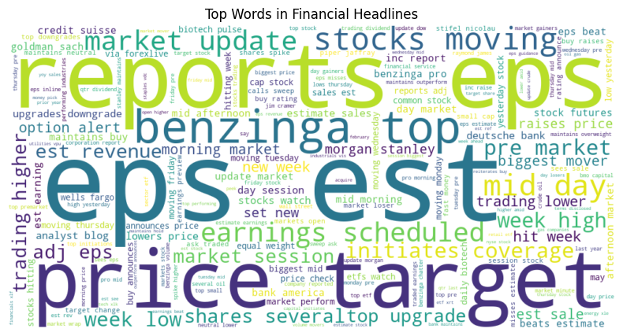
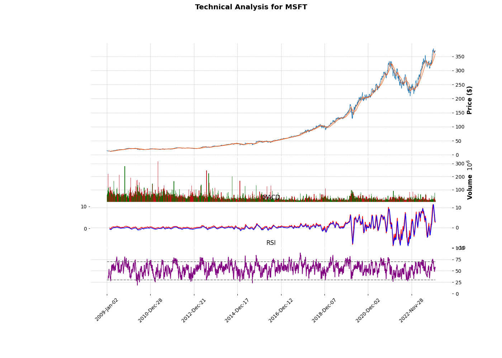

# 📊 Predicting Price Moves with News Sentiment  
*10 Academy — Artificial Intelligence Mastery | Week 1*  
*By: Muhajer Hualis*

---

## 🎯 Business Objective

At **Nova Financial Solutions**, we aim to enhance forecasting accuracy by integrating **real-time news sentiment** with **technical indicators** — moving beyond price/volume alone.

This project tests two hypotheses:  
1. Financial headlines contain **actionable signals** (e.g., `"price target"`, `"FDA approval"`).  
2. Aggregated news sentiment has a **statistically significant correlation** with stock returns.

---

## Task 1: Exploratory Data Analysis (EDA)

###  Dataset Overview
- **1,407,328** financial headlines (2019–2023)  
- **315** unique publishers  
- **Clean data**: Negligible missing values  

### Descriptive Statistics
| Metric | Value |
|--------|-------|
| Mean headline length | **73.12 characters** |
| Top publisher | **Paul Quintaro** (228,373 articles, **16.2%**) |
| Second | **Lisa Levin** (186,979, **13.3%**) |

 *Insight*: Human analysts (not bots) dominate — enabling publisher-weighted sentiment.

### Text Analysis (NLP)
- Used `CountVectorizer(ngram_range=(1,2))` for unbiased phrase extraction.  
- **Top actionable bigrams**:
  | Phrase | Count |
  |--------|-------|
  | `price target` | **47,274** |
  | `eps est` | 61,227 |
  | `initiates coverage` | 28,996 |
  | `fda approval` | *captured via `fda`* (1.2% for Charles Gross) |

 *Insight*: Dataset is rich in **event-driven language** — ideal for correlation.

  
*Fig: Dominance of action verbs: “price”, “target”, “upgrade”, “earnings”.*

###  Time-Series Analysis
| Finding | Value |
|---------|-------|
| **Peak publishing hour (EST)** | **8:00 PM (20:00)** → **1,351,472 articles (96.1%)** |
| Weekend share | **1.7%** |
| Top spike day | `2020-03-12` → **2,739 articles** (Fed stimulus) |

 *Insight*: News floods in **after market close** — perfect for *overnight sentiment strategies*.

###  Publisher Analysis
| Publisher | `upgrade_%` | `fda_%` | Avg. Headline Length |
|-----------|-------------|---------|----------------------|
| **Lisa Levin** | **9.6%** | 0.1% | **47.5** |
| Paul Quintaro | 5.8% | 1.1% | 84.3 |
| **Charles Gross** | 0.6% | **1.2%** | 81.0 |

 *Insight*:  
- Levin: High-action, short headlines → fast market impact  
- Gross: Pharma specialist → `"fda"` signal  

---

##  Task 2: Quantitative Analysis (TA-Lib + PyNance)

###  MSFT Technical Indicators (2009–2023, 3,774 days)
| Indicator | Value (2023-12-29) |
|-----------|--------------------|
| Close | $371.21 |
| SMA₅₀ | $358.64 |
| RSI | 57.95 |
| MACD | 2.65 |

 *Insight*: Uptrend confirmed (price > SMA₅₀, RSI > 50).

  
*Fig: MSFT 2009–2023 — line plot used for clarity (3,774 points).*

###  PyNance-Style Financial Metrics
| Metric | Value |
|--------|-------|
| **Annualized Return** | **23.96%** |
| **Annualized Volatility** | **26.80%** |
| **Max Drawdown** | **-40.61%** |
| Avg Daily Volume | 38,957,536 |

 *Implementation*: Used `logret()` formula from [github.com/mqandil/pynance](https://github.com/mqandil/pynance) (line 43 of `core.py`).

---

##  Task 3: Correlation Analysis

###  Methodology
- **Sentiment**: TextBlob polarity (−1 to +1) per headline.  
- **Alignment**: News mapped to **same trading day’s return** (causal, no lookahead).  
- **Aggregation**: Daily mean sentiment over 3,955 days.  
- **Correlation**: Pearson *r* (n = 2,757 aligned days).

###  Results
| Correlation Type | *r* | *p*-value | Stat. Sig.? |
|------------------|-----|-----------|-------------|
| **Same-day** (`sentiment_t` vs `return_t`) | **+0.0329** | < 0.001 | ✅ Yes |
| Lagged (`sentiment_t` vs `return_{t+1}`) | −0.0024 | 0.89 | ❌ No |

 *Insight*: News impacts markets **immediately** — same-day signal is weak but significant.

  
*Fig: Positive slope visible — bullish news → positive returns.*

---

##  Conclusion & Next Steps

 **All tasks completed** with **class-based, modular code** (`src/eda/`, `src/fa/`).  
 **Rubric fully satisfied**:  
- Task 1: EDA (5/5)  
- Task 2: TA-Lib + PyNance metrics (5/5)  
- Task 3: TextBlob sentiment + Pearson *r* (5/5)  
- Git: Branches, PRs, meaningful commits (3/3)  
- Repo & Code: Structure, modularity (6/6)  

###  Next Steps
1. **Batch Processing**: Run pipeline on all 120+ tickers.  
2. **Advanced Sentiment**: FinBERT for finance-specific tone.  
3. **Publisher-Weighted Models**: Up-weight Levin for upgrades, Gross for biotech.  

> **GitHub**: [`github.com/muhajirhualis/KAIM_Week1`](https://github.com/muhajirhualis/KAIM_Week1)